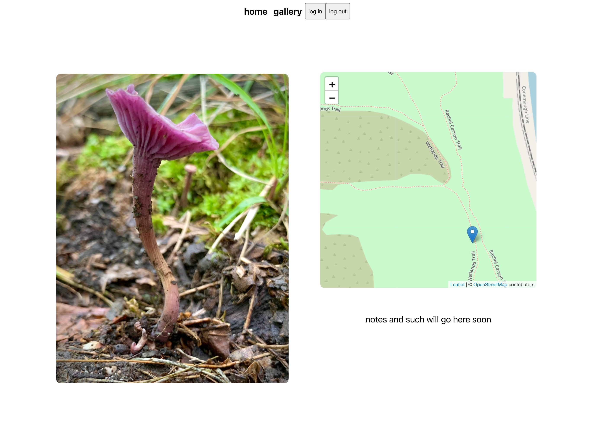

gallery | detail view 
------------ | ------------- 
| 

## Credits
[conditional rendering prop data from axios call](https://codewithnico.com/react-wait-axios-to-render/), [Nicolás Gómez](https://github.com/muZk)

[modal + upload form](https://blog.bitsrc.io/build-a-full-featured-modal-dialog-form-with-react-651dcef6c571), [Krissanawat​ Kaewsanmuang](https://medium.com/@krissanawat)

[nodejs cloudinary upload](https://www.youtube.com/watch?v=Rw_QeJLnCK4), [James Q Quick](https://twitter.com/jamesqquick)

[MERN user authentication tutorial](https://www.youtube.com/playlist?list=PLJM1tXwlGdaf57oUx0rIqSW668Rpo_7oU)[Joost Bijlsma](https://github.com/jgbijlsma)

[setting up Context and Reducer](https://www.queworx.com/blog/redux-not-needed-replacing-with-usecontext-and-usereducer-in-react/), [Eddie Svrsky](https://www.queworx.com/blog/author/esvirsky/). 